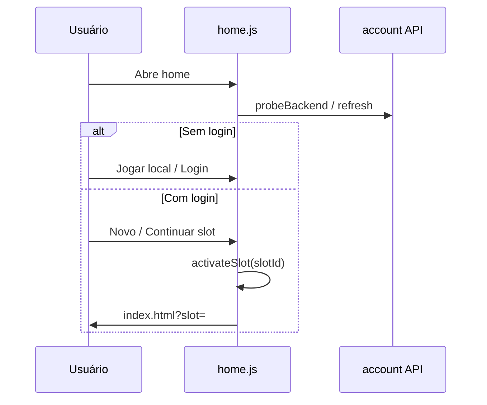
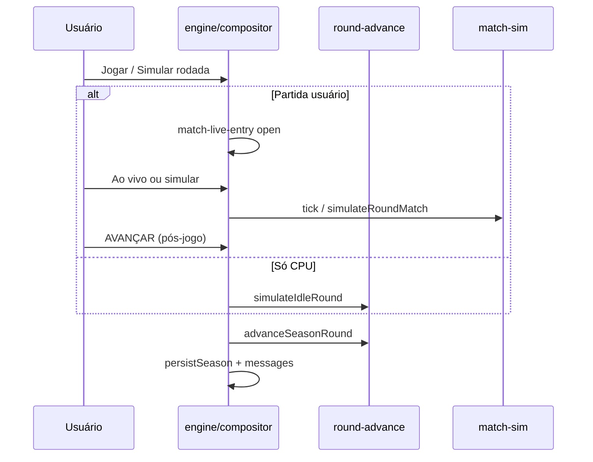

# 04 — Rotinas e fluxos

## Boot da home (`home.html`)



## Boot do jogo (`main.js` → `engine.js`)

| Etapa | Módulo | Ação |
|-------|--------|------|
| 1 | `career-activate` | `runCareerBootMigration()` |
| 2 | `main.js` | Auth gate, `prepareGameSession` |
| 3 | `storage-api` | `ensureStorageHydrated`, merge nuvem |
| 4 | `career-slot-manager` | `hydrateSlot` → chaves ativas |
| 5 | `engine.js` | `bootEngine()` |
| 6 | pyramid + clubs bootstrap | Mundo e elencos |
| 7 | features | `createDashboard`, `createTactics`, … |
| 8 | `main.js` | `markBootReady()` |

Pós-boot (idle): restore partida ao vivo → sim idle CPU → transição de temporada.

---

## Nova carreira

1. Home → **Novo Jogo** ou slot vazio → criador (Opções / modal).
2. Coleta: técnico, clube, divisão, UF/origem (se estadual).
3. `persistCareer` + geração pirâmide/elencos/calendário.
4. Redirect `index.html` (com `?slot=` se aplicável).
5. Sponsor picker se pendente; dashboard hidratado.

**Cancelar sem save:** volta `home.html`.

---

## Navegação

```
.nav[data-view] → click
  → router (ui/router.js)
  → feature.render*()
```

Features lazy: calendário (`calendar-view`), mercado (`transfers-ui`).

---

## Rodada de campeonato



---

## Partida ao vivo

1. `#playMatch` → `match-live-entry` valida calendário/sponsor.
2. Pré-jogo: escalação, tática (`tactics` + `openPreparation`).
3. `match-live-orchestration.tick` / relógio (`match-clock`).
4. Pênaltis / shootout: handlers em `match-live-entry` + orchestration.
5. Fim: `match-live-session.renderFinalSummary` → NOTAS / AVANÇAR.
6. `exitLiveMatch` → `advanceSeasonRound`.

**Restore:** `live-match-persist` + `tryRestoreLiveMatch` no boot.

---

## Fim de temporada

1. Última rodada / copa resolvida → `seasonComplete`.
2. `season-transition.prepareSeasonTransition`.
3. Modal `season-summary` — campeões, prêmios, objetivos.
4. `#startNextSeason` → novo calendário, movimentações, ranking.

---

## Sync nuvem (por slot)

| Evento | Comportamento |
|--------|---------------|
| Login | Merge remoto → local |
| Troca slot | Flush slot anterior, `hydrateSlot` novo |
| `pagehide` com carreira | `markCareerReloadPending`, skip session end |
| Debounce save | `career-slot-manager` + `storage-api` |

---

## Documentação relacionada

- [Arquitetura — Sync](./02-ARQUITETURA.md)
- [Modelos de dados](./05-MODELOS-DADOS.md)
- [Interface](./06-INTERFACE.md)
